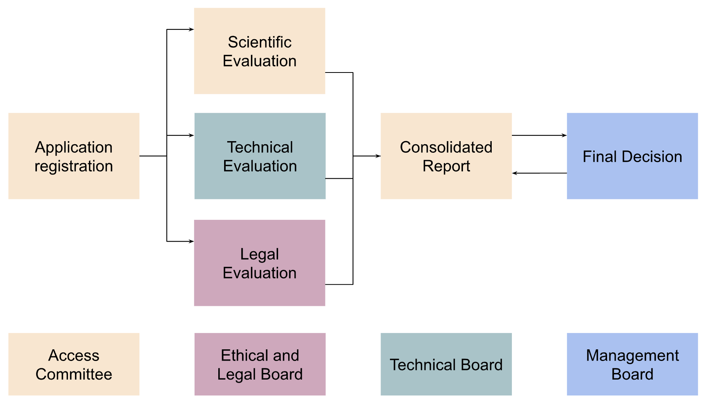
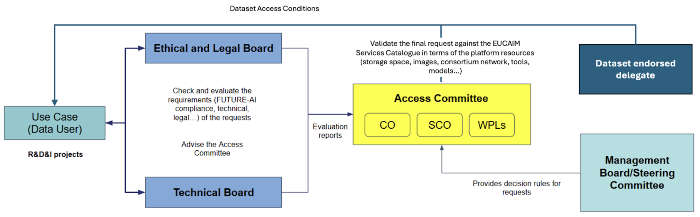

# 2. Governance

## 2.1. Data governance

Data provision in EUCAIM follows a structured process led by its operational boards, each playing a key role in ensuring that incoming datasets meet the platform’s scientific, technical and legal standards.

When a Data Holder submits an application to join the federation using the **Expression of Interest**, the **Access Committee** initiates the review process. It coordinates with the **Technical Board** (TB) which evaluates whether the proposed infrastructure, anonymisation protocols, risk analysis and data quality controls are in line with EUCAIM’s technical requirements. At the same time, the **Ethical and Legal Board** assesses the legal documentation submitted as evidence for the technical aspects reviewed by TB, verifying its compliance with data protection and ethical norms. 

Once all evaluations are completed, the Access Committee prepares a consolidated report which is sent to the **Management Board** and **Steering Committee** to make the final decision. Throughout the process, Data Holders are expected to collaborate closely with the involved boards, provide documentation, and requests for clarification. [Figure 1](#fig_dataprov) shows a graphical representation of this process.

### 

Once the data is registered and available through the EUCAIM Platform, the access for the Data Users will be submitted through the negotiator component and will be subject to the evaluation of the Access Committee. The AC evaluates the applications and informs the Management board and the DH, when needed. Federated DHs will be involved in the negotiation process  for the agreement on the data access conditions. [Figure 2](#fig_dureq) shows a graphical schema of the process. 

### 

The Data Holders must provide a contact point, in case of a federated node, and should endorse the EUCAIM AC to request the signature of the access conditions in the case of transferring the data to a reference node. This is explained in more detail in the next section.
